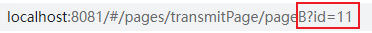

### uniapp页面跳转传参

> uniapp从A页面跳转到B页面时可在跳转路径的后缀加上要传递的参数，可传多个参数，A页面传值可通过跳转事件携带参数拼接在跳转路径后面进行跳转；进入B页面后在onload内通过option进行接收，代码如下：

**A页面主要代码**

1. view结构部分

   ```vue
   <view class="jumpBpage" @click="getBpage(id)">跳转B页面</view>
   ```

   

2. js部分

   ```js
   //在return里对id的值进行定义
   return {
       id: '11',
   }
   //methods方法，把id拿到方法里进行拼接
   getBpage(id){
       uni.navigateTo({
           console.log('id值', id);
           //页面跳转时拼接在跳转路径后进行传递
           url:'/pages/transmitPage/pageB?id='+id,
       })
   },
   ```

**B页面主要代码**

- 跳转B页面时可在跳转路径看到已拼接成功的路径

  

- onload部分,在B页面的return里定义一个参数(content),把传过来的id赋值给content就可以进行使用；

  ```js
  //return里对content进行定义
  return {
      content: '',
  }
  //在onload里取得传过来的id
  onLoad(option) {
      console.log('我接收到', option);
      this.content = option.id;
  },
  ```

  

**==完整代码如下==**

**A页面**

```vue
<template>
	<view class="content">
       <!-- 跳转页面时通过click携带参数 -->
		<view class="jumpBpage" @click="getBpage(id)">跳转B页面</view>
	</view>
</template>

<script>
	export default {
		data() {
			return {
				id: '11',
			}
		},
		onLoad() {
			
		},
		methods: {
			getBpage(id){
				uni.navigateTo({
                    //页面跳转时拼接在跳转路径后进行传递
					url:'/pages/transmitPage/pageB?id='+id,
				})
			},
		}
	}
</script>

<style>
	.content{
		display: flex;
		justify-content: center;
	}
	.jumpBpage{
		display: flex;
		justify-content: center;
		align-items: center;
		width: 300rpx;
		height: 77rpx;
		margin-top: 200rpx;
		color: #fff;
		background-color: rgb(0, 64, 255);
		border: 5rpx solid rgb(102, 102, 255);
		border-radius: 15rpx;
		
	}
</style>
```

**B页面**

```
<template>
	<view class="content">
		<view class="titles">
			<view>传过来的id:</view>
			<view class="contBox">{{content}}</view>
		</view>
	</view>
</template>

<script>
	export default {
		data() {
			return {
				content:'',
			}
		},
		onLoad(option) {
			console.log('我接收到', option);
			this.content = option.id;
		},
		methods: {
	
		}
	}
</script>

<style>
	.content{
		display: flex;
		justify-content: center;
	}
	.titles{
		height: 100rpx;
		width: 100%;
		display: flex;
		justify-content: baseline;
		align-items: center;
	}
	
	.contBox{
		width: 100rpx;
		height: 100%;
		display: flex;
		justify-content: center;
		align-items: center;
		color: #fff;
		margin-left: 10rpx;
		background-color: rgb(51, 51, 77);
	}
</style>
```

