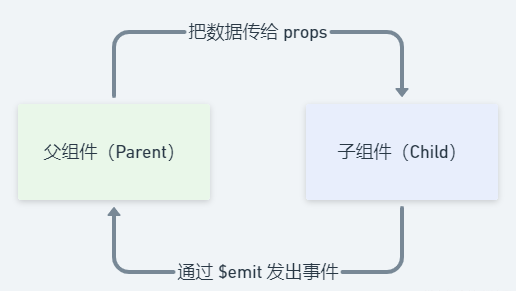

## vue组件之间的通信

创建subject.vue为父组件，子组件分别为oneBox.vue、twoBox、threeBox

​	subject.vue

```vue
<template>
	<view class="content">
		<view class="faCont">
			<view class="faShurBox">
				<view class="">父组件输入</view>
				<input class="fainp" type="text" v-model="fzjsr">
			</view>
		</view>
		<view>
			<one-box :shurneir="fzjsr"></one-box>
		</view>
		<view>
			<two-box v-bind="info"></two-box>
		</view>
		<view>
			<three-box @nadaoz="getChild"></three-box>
		</view>
	</view>
</template>

<script>
	import oneBox from './oneBox.vue'
	import twoBox from './twoBox.vue'
	import threeBox from './threeBox.vue'
	
	export default {
		data(){
			return {
				fzjsr:'',
				info:{
						name:'kevin',
						number: 7,
					},
					
			}
		},
		components: {
			oneBox,
			twoBox,
			threeBox,
		},
		onLoad() {
			
		},
		methods:{
			getChild(e){
				console.log('父组件拿到值', e);
			},
		},
	}
</script>

<style >
page{
	width:100%;
	height:100%;
}
.content{
	width:100%;
	height:100%;
	display:flex;
	flex-direction: column;
}
.faCont{
	width: 100%;
	height: 250rpx;
	background-color: #ff9a8c;
	display: flex;
	justify-content: center;
}
.faShurBox{
	width: 100%;
	height: 100rpx;
	display: flex;
	justify-content: center;
	align-items: center;
}
.fainp{
	margin-left: 10rpx;
	background-color: #fff;
}
</style>
```

​	oneBox.vue

```vue
<template>
  <view class="content">
    <view class="oneBox">
        <view class="zizujxs">子组件显示：{{shurneir}}</view>
    </view>
  </view>
</template>

<script>
  export default {
    data(){
		return {
			
		}
	},
	props:{
		shurneir:null,
	}
  }
</script>

<style scoped>
page{
	width:100%;
	height:100%;
}
.content{
	width:100%;
	height:100%;
	display:flex;
	flex-direction: column;
}
.oneBox{
	width: 100%;
	height: 100rpx;
	background-color: #c5cbff;
}
.zizujxs{
	width: 100%;
	height: 80rpx;
	/* background-color: #fff; */
	display: flex;
	justify-content: center;
	align-items: center;
}
</style>
```


- 父子组件之间的通信方式
  - 父组件传递数据给子组件：通过==props==属性；
  - 子组件传递给父组件：通过==$emit==触发事件；



- 父组件传递给子组件

  - 直接传对象

    在父组件的one-box里直接写入元素的名字和值

    ```vue
    <one-box :shurneir="fzjsr"></one-box>
    ```

    子组件接收：在props里直接接收显示

    ```vue
    //template的内容
    <view class="zizujxs">子组件显示：{{shurneir}}</view>
    
    
    <script>
      export default {
        data(){
    		return {
    			
    		}
    	},
    	props:{
    		shurneir:null,//指定类型（null 和 undefined 值会通过任何类型验证）
    	}
      }
    </script>
    ```

  - ​	v-bind可以传递所有数据:

    ```vue
    父组件在template使用v-bind
    <two-box v-bind="info"></two-box>
    
    //父组件的在data中定义info
    data(){
    	return {
    		info:{
    			name:'kevin',
    			number: 7,
    		}
    	}
    }
    ```

    子组件在props中接收还是一样的方式:

    ```vue
    在子组件的template中显示
    <view class="">name的值:{{name}}</view>
    <view class="">number的值:{{number}}</view>
    
    props:{
    	name:null,
    	number:{
    		type: Number,
    	},
    }
    ```

- 子组件传值给父组件，通过触发事件进行传输，比如通过threeBox.vue的点击事件给父组件subject.vue进行传值：

  - this.$emit()是传值的发送事件

    ```js
    //括号里面的第一个值表示父组件的监听事件的名称，第二个值表示需要传的值
    this.$emit('nadaoz', this.mindList[index]);
    ```

    three.vue代码

    ```vue
    <template>
      <view class="content">
        <view class="threeBox">
            <view class="xiaofk" @click="passValue(index)"
    		 v-for="(item,index) in mindList" :key="index">
            	<view class="">{{item.name}}</view>
            	<view class="">{{item.number}}</view>
            </view>
        </view>
      </view>
    </template>
    
    <script>
      export default {
        data(){
    		return {
    			mindList:[
    				{
    					name:'kevin',
    					number: 7,
    				},
    				{
    					name:'kyrie',
    					number: 11,
    				},
    				{
    					name:'harden',
    					number: 13,
    				}
    			]
    		}
    	},
    	methods:{
    		passValue(index){
    			//点击传给父组件
    			console.log('看看值',this.mindList[index]);
    			this.$emit('nadaoz', this.mindList[index]);
    		},
    	},
    	
      }
    </script>
    
    <style scoped>
    page{
    	width:100%;
    	height:100%;
    }
    .content{
    	width:100%;
    	height:100%;
    	display:flex;
    	flex-direction: column;
    }
    .threeBox{
    	width: 100%;
    	height: 200rpx;
    	background-color: #c1c1c1;
    	display: flex;
    }
    .xiaofk{
    	width: 200rpx;
    	height: 200rpx;
    	color: #fff;
    	background-color: #000000;
    	margin-left: 10rpx;
    	display: flex;
    	flex-direction: column;
    	justify-content: center;
    	align-items: center;
    }
    </style>
    ```

    subject.vue代码

    ```vue
    template里的代码，@nadaoz是在子组件里面定义的
    <three-box @nadaoz="getChild"></three-box>
    
    //js代码，在methods里面拿到，e就是子组件传过来的值了
    methods:{
    	getChild(e){
    		console.log('父组件拿到值', e);
    	},
    },
    
    
    ```

    