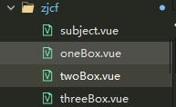

## vue组件化开发

​		在真实开发中，如果把所有的内容都放在一个vue文件里，随着代码量越来越大，极大地影响到代码的可维护性和扩展性。应对这种情况，我们会对这些代码进行拆分为不同的组件，每个小组件都拥有自己的逻辑和功能，开发时我们只需要在对应的组件里进行相应的开发就可以了。把所有小组件合并起来就成为一个大的文件。

假设把subject.vue进行组件化拆分为partOne、paryTwo和partThree三个部分

下面是拆分前subject.vue的代码

```vue
<template>
	<view class="content">
		<view class="oneBox">
			<view>第一部分内容</view>
		</view>
		<view class="twoBox">
			<view>第二部分内容</view>
			<view class="">2222222</view>
		</view>
		<view class="threeBox">
			<view>第三部分内容</view>
			<view class="">three-points</view>
			<view class="">333333</view>
		</view>
	</view>
</template>

<script>
	export default {
		data(){
			return {
				
			}
		},
		onLoad() {
			
		},
		methods:{
			
		},
	}
</script>

<style >
page{
	width:100%;
	height:100%;
}
.content{
	width:100%;
	height:100%;
	display:flex;
	flex-direction: column;
}
.oneBox{
	width: 100%;
	height: 200rpx;
	background-color: #c5cbff;
}
.twoBox{
	width: 100%;
	height: 200rpx;
	background-color: #cbffca;
}
.threeBox{
	width: 100%;
	height: 300rpx;
	background-color: #ffb7b0;
}
</style>
```

将代码进行拆分后多出来三个独立的vue文件：oneBox.vue、twoBox.vue、threeBox.vue



oneBox.vue：

```vue
<template>
  <view class="content">
    <view class="oneBox">
        <view>第一部分内容</view>
    </view>
  </view>
</template>

<script>
  export default {
    
  }
</script>

<style scoped>
page{
	width:100%;
	height:100%;
}
.content{
	width:100%;
	height:100%;
	display:flex;
	flex-direction: column;
}
.oneBox{
	width: 100%;
	height: 200rpx;
	background-color: #c5cbff;
}
</style>
```

twoBox.vue：

```vue
<template>
  <view class="content">
    <view class="twoBox">
        <view>第二部分内容</view>
        <view class="">2222222</view>
    </view>
  </view>
</template>

<script>
  export default {
    
  }
</script>

<style scoped>
page{
	width:100%;
	height:100%;
}
.content{
	width:100%;
	height:100%;
	display:flex;
	flex-direction: column;
}
.twoBox{
	width: 100%;
	height: 200rpx;
	background-color: #cbffca;
}
</style>
```

threeBox.vue：

```vue
<template>
  <view class="content">
    <view class="threeBox">
        <view>第三部分内容</view>
        <view class="">three-points</view>
        <view class="">333333</view>
    </view>
  </view>
</template>

<script>
  export default {
    
  }
</script>

<style scoped>
page{
	width:100%;
	height:100%;
}
.content{
	width:100%;
	height:100%;
	display:flex;
	flex-direction: column;
}
.threeBox{
	width: 100%;
	height: 300rpx;
	background-color: #ffb7b0;
}
</style>
```

一般情况下我们做局部注册，在subject.vue进行拆分组件import引入后，在components进行注册，就可以进行组件的使用了。

引入后的subject.vue:

```vue
<template>
	<view class="content">
		<view>
			<one-box></one-box>
		</view>
		<view>
			<two-box></two-box>
		</view>
		<view>
			<three-box></three-box>
		</view>
	</view>
</template>

<script>
	import oneBox from './oneBox.vue'
	import twoBox from './twoBox.vue'
	import threeBox from './threeBox.vue'
	
	export default {
		data(){
			return {
				
			}
		},
		components: {
			oneBox,
			twoBox,
			threeBox,
		},
		onLoad() {
			
		},
		methods:{
			
		},
	}
</script>

<style >
page{
	width:100%;
	height:100%;
}
.content{
	width:100%;
	height:100%;
	display:flex;
	flex-direction: column;
}
.oneBox{
	width: 100%;
	height: 200rpx;
	background-color: #c5cbff;
}
.twoBox{
	width: 100%;
	height: 200rpx;
	background-color: #cbffca;
}
.threeBox{
	width: 100%;
	height: 300rpx;
	background-color: #ffb7b0;
}
</style>
```

引入成功后用view包住引入组件，得到的效果和未拆分之前的一样。
